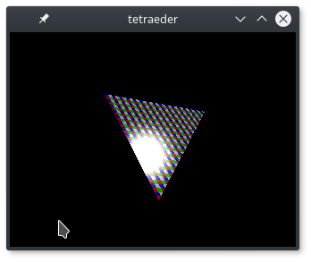

# FSim

Small library to define and render OpenGL objects.



## Install dependencies
```
sudo apt-get install colorgcc freeglut3-dev libglew-dev libmagickcore-dev libgc-dev
```

## Build
```
./bootstrap
./configure CC=colorgcc
make -j
make check -j
```

## Run
```
./tetraeder
```

# External links

* [OpenGL GLSL vertex buffer objects example][1]
* [OpenGL tutorial][2]
* [OpenGL triangle][3]
* [µnit - unit testing framework for C][23]
* [ThreeJs][4]
* [GLFW][5]
* [Godot Engine][6]
* [OpenGL shadow mapping][7]
* [The Book of Shaders][8]
* [Vertex transformations][9]
* [Tiny obj loader][10] (also see [C version][11])
* [Vertex buffer indexing][12]
* [Reaction Engines Scramjet][13]
* [Star Citizen demo video][14]
* [High dynamic range effects][15]
* [Bullet physics engine][16]
* [Gmsh Mesh generator and file format][24]
* *[Wavefront OBJ library in C with an OpenGL Core Profile renderer][17]*
* [Spherical cube map rendering library][18]
* [Boehm garbage collector interface][19]
* [Getting Core Dumps of Failed TravisCI Builds][20]
* [EF2000 by DID][21]
* [Prepar3D][22]

[1]: http://www.songho.ca/opengl/gl_vbo.html
[2]: https://github.com/opengl-tutorials/ogl
[3]: https://open.gl/drawing
[4]: https://threejs.org/examples/
[5]: http://www.glfw.org/
[6]: https://godotengine.org/
[7]: http://www.opengl-tutorial.org/intermediate-tutorials/tutorial-16-shadow-mapping/
[8]: https://thebookofshaders.com/
[9]: https://en.wikibooks.org/wiki/GLSL_Programming/Vertex_Transformations
[10]: https://syoyo.github.io/tinyobjloader/
[11]: https://github.com/syoyo/tinyobjloader-c
[12]: http://www.opengl-tutorial.org/intermediate-tutorials/tutorial-9-vbo-indexing/
[13]: https://www.youtube.com/watch?v=qgtZCXYmkDU
[14]: https://www.youtube.com/watch?v=3l-epO6oUHE
[15]: https://github.com/karimnaaji/hdreffects
[16]: http://bulletphysics.org/
[17]: https://github.com/rlk/obj
[18]: https://github.com/rlk/scm
[19]: http://www.hboehm.info/gc/gcinterface.html
[20]: http://jsteemann.github.io/blog/2014/10/30/getting-core-dumps-of-failed-travisci-builds/
[21]: https://en.wikipedia.org/wiki/EF2000_(video_game)
[22]: https://www.prepar3d.com/
[23]: https://nemequ.github.io/munit/
[24]: http://gmsh.info/
